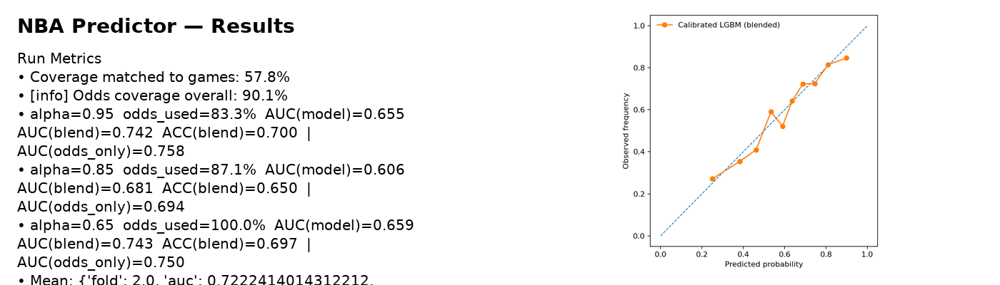

# HoopsLab

**Goal.** Predict **home win probability** *pre-game* using lagged/rolling team form, rest, and pre-game Elo, with **time-aware** validation and **isotonic-calibrated** LightGBM; **blends** with market odds (when available) for sharp, realistic probabilities.

> Put your results banner at `assets/results_strip.png` (or update the path below).


## Key achievements
- **Consistent performance across walk-forward folds** that mirrors real deployment.  
- **Strong calibration** from **isotonic scaling** and **post-hoc odds blending**.  
- **Leakage-robust design** using strictly **pre-game** features and time-ordered splits.  
- **Transparent diagnostics**: reliability curve, odds coverage checks, and odds-only baselines.

## What makes it strong
- **Leakage-safe pre-game features:** lag-1 **rolling (3/5/10)** team stats as **home–away diffs**, **`rest_diff`**, and **`elo_pre_diff`** only.  
- **Time-aware evaluation:** **walk-forward CV** (no shuffle) with a **calibration tail**.  
- **Well-calibrated probabilities:** **isotonic calibration** + **α-blended** odds prior (**odds are not features**).  
- **Diagnostics & artifacts:** reliability (calibration) plot and a build sentinel for automation.

---

## Repo structure

├─ notebooks/
│ ├─ NBA_Predictor_Colab2.ipynb # training
│ └─ NBA_EDA_v2.ipynb # leakage-safe EDA
│
├─ scripts/
│ └─ train_full_colab.py # runnable training script
│
├─ src/
│ └─ plus/ # helper modules (metrics, odds, elo/rest, features, splits)
│
├─ assets/
│ └─ results_strip.png # metrics + calibration banner
│
├─ data/ # input CSVs (not committed)
│
├─ models/ # outputs: reliability.png, FINISHED.txt (not committed)
│
├─ requirements.txt
└─ README.md


## Data
- **Games:** `data/games.csv` with `GAME_DATE`, `HOME_TEAM_ABBREV`, `AWAY_TEAM_ABBREV`, and outcome (or final points).  
- **Optional odds:** `data/odds.csv` → merged to `fair_home_prob` (from moneylines or provided implied prob).  
- **Artifacts:** `models/reliability.png`, `models/FINISHED.txt`.

---

## Quickstart

### A) Run in Google Colab
1. Open `notebooks/NBA_Predictor_Colab2.ipynb`.  
2. Put your CSVs under `data/` (and `odds.csv` if using odds).  
3. Run all cells. Artifacts appear in `models/` and the reliability plot is saved.

### B) Run locally in VS Code (Windows)
1. Create and activate a venv, then install deps:
   ```powershell
   python -m venv .venv
   .\.venv\Scripts\Activate.ps1
   pip install --upgrade pip
   pip install -r requirements.txt

2. Set environment variables (same as Colab):
$env:DATA_GAMES="data\games.csv"
$env:ODDS_CSV="data\odds.csv"       # omit if not using odds
$env:DATE_MIN="2012-10-01"
$env:N_FOLDS="3"
$env:N_TREES="800"
$env:CAL_FRAC="0.2"
$env:SEED="42"

3. Run
python scripts\train_full_colab.py

## Techniques
- **LightGBM** → **isotonic calibration** → **odds blending** with per-fold **α** tuned on the calibration slice.  
- **Walk-forward CV** (contiguous, no shuffle).  
- Feature set: `*_roll*_diff`, `rest_diff`, `elo_pre_diff` (extras like Four Factors/pace/travel ready to toggle).

## EDA
See **`notebooks/NBA_EDA_v2.ipynb`** for:
- Coverage & NA checks, season distribution  
- Home-court advantage (overall & by season)  
- Rest days / back-to-backs and outcome effects  
- Optional **odds** coverage + odds **reliability**  
- Optional simple **pre-game Elo** correlation checks


